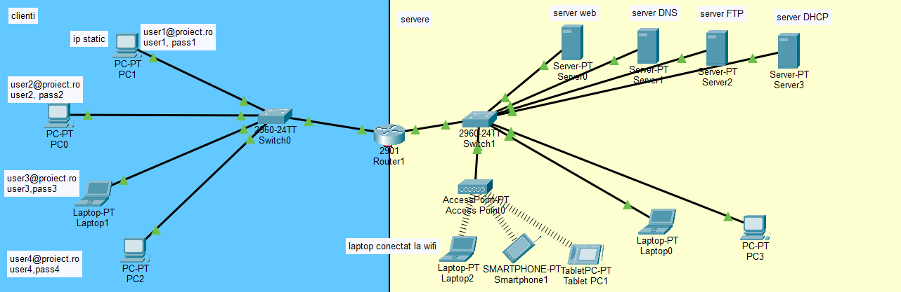

# Enterprise Network Infrastructure - 2026

## EN

### Project Overview
This project demonstrates a functional enterprise network architecture designed in Cisco Packet Tracer. The infrastructure is built around a central router connecting two distinct networks (Client Zone and Server Zone) with integrated wireless access and core network services.

### Network Architecture
The network is split across two main router interfaces:
* **Interface 0/0 (Client Zone)**: Connected to Switch 0, serving the workstations.
    * **PC1**: Configured with a **Static IP** for administrative consistency.
    * **Other Workstations**: Configured with **Dynamic IPs** provided by the DHCP server.
* **Interface 0/1 (Server Zone)**: Connected to Switch 1, hosting the critical server farm and wireless infrastructure.

### Server Farm Services
The Server Zone hosts 5 specialized servers providing essential network functions:
1.  **Web Server (HTTP/HTTPS)**: Hosts the organization's website content.
2.  **DNS (Domain Name System)**: Translates human-readable domain names into IP addresses. 
    * *Note: The **Email Server** configuration is integrated within the DNS server settings for this project.*
3.  **FTP (File Transfer Protocol)**: Used for secure file sharing and storage across the network.
4.  **DHCP (Dynamic Host Configuration Protocol)**: Automates IP addressing. It contains **two separate pools** to serve both the Client and Server zones automatically.
5.  **Email Server**: Enables communication between devices; specific workstations have already been configured with email accounts to test connectivity.

### Wireless Integration
The Server Zone includes a wireless segment:
* **Infrastructure**: An **Access Point** is connected to Switch 1.
* **Security**: The Access Point is secured with a specific SSID (Network Name) and Password.
* **Devices**: Three wireless devices are connected.
    * **Hardware Modification**: For the Laptop to connect, the default Ethernet module was replaced with a **WPC300N** wireless module.
    * **Manual Connection**: Devices were manually linked to the SSID via the "PC Wireless" utility in the Desktop tab.

### Security and Administration
* **Router Security**: The router is fully configured with encrypted passwords for console and VTY access.
* **Access Control**: **ACL (Access Control Lists)** rules have been implemented to filter traffic and enhance network security.

### Visualization

---

## RO

### Prezentare Proiect
Acest proiect demonstrează o arhitectură de rețea enterprise funcțională, proiectată în Cisco Packet Tracer. Infrastructura este construită în jurul unui router central care conectează două rețele distincte (Zona Clienți și Zona Servere) cu acces wireless integrat și servicii de rețea esențiale.

### Arhitectura Rețelei
Rețeaua este împărțită pe două interfețe principale ale routerului:
* **Interfața 0/0 (Zona Clienți)**: Conectată la Switch 0, deservind stațiile de lucru.
    * **PC1**: Configurat cu **IP Static** pentru consistență administrativă.
    * **Celelalte stații**: Configurate cu **IP-uri Dinamice** furnizate de serverul DHCP.
* **Interfața 0/1 (Zona Servere)**: Conectată la Switch 1, găzduind ferma de servere și infrastructura wireless.

### Servicii Fermă de Servere
Zona Servere găzduiește 5 servere specializate care oferă funcții esențiale:
1.  **Web Server (HTTP/HTTPS)**: Găzduiește conținutul site-ului web al organizației.
2.  **DNS (Domain Name System)**: Traduce numele de domenii în adrese IP.
    * *Notă: Configurarea **Serverului de Email** este integrată în setările serverului DNS pentru acest proiect.*
3.  **FTP (File Transfer Protocol)**: Utilizat pentru partajarea și stocarea securizată a fișierelor în rețea.
4.  **DHCP (Dynamic Host Configuration Protocol)**: Automatizează adresarea IP. Conține **două pool-uri separate** pentru a deservi automat atât zona Clienților, cât și zona Serverelor.
5.  **Email Server**: Permite comunicarea între dispozitive; anumite stații de lucru au deja conturile de email configurate pentru a testa conectivitatea.

### Integrare Wireless
Zona Serverelor include un segment wireless:
* **Infrastructură**: Un **Access Point** este conectat la Switch 1.
* **Securitate**: Access Point-ul este securizat cu un SSID (Nume Rețea) și o parolă specifică.
* **Dispozitive**: Trei dispozitive wireless sunt conectate.
    * **Modificare Hardware**: Pentru ca Laptop-ul să se poată conecta, modulul Ethernet implicit a fost înlocuit cu un modul wireless **WPC300N**.
    * **Conectare Manuală**: Dispozitivele au fost conectate manual la SSID prin utilitarul "PC Wireless" din tab-ul Desktop.

### Securitate și Administrare
* **Securitate Router**: Router-ul este configurat complet cu parole criptate pentru accesul la consolă și VTY.
* **Control Acces**: Au fost implementate reguli **ACL (Access Control Lists)** pentru filtrarea traficului și creșterea securității rețelei.

### Vizualizare

